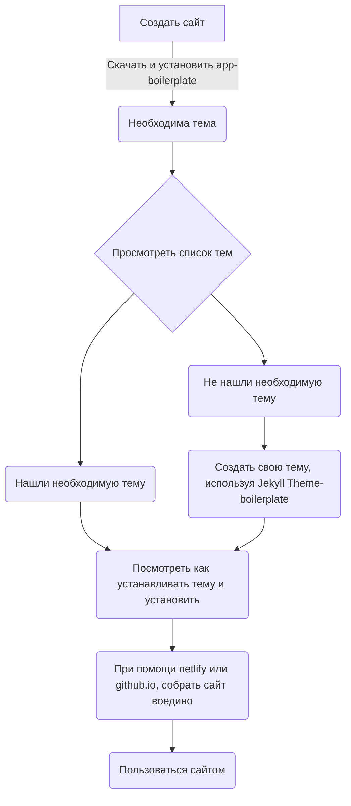

# Structure

```mermaid
graph TD
A[Создать сайт]-->|Скачать и установить app-boilerplate| B(Необходима тема)
B-->C{Просмотреть список тем}
C-->D(Нашли необходимую тему)
C-->E(Не нашли необходимую тему)
D-->F(Посмотреть как устанавливать тему и установить)
F-->G(При помощи netlify или github.io, собрать сайт воедино)
E-->H(Создать свою тему, используя Jekyll Theme-boilerplate)
H-->F
G-->I(Пользоваться сайтом)
```
