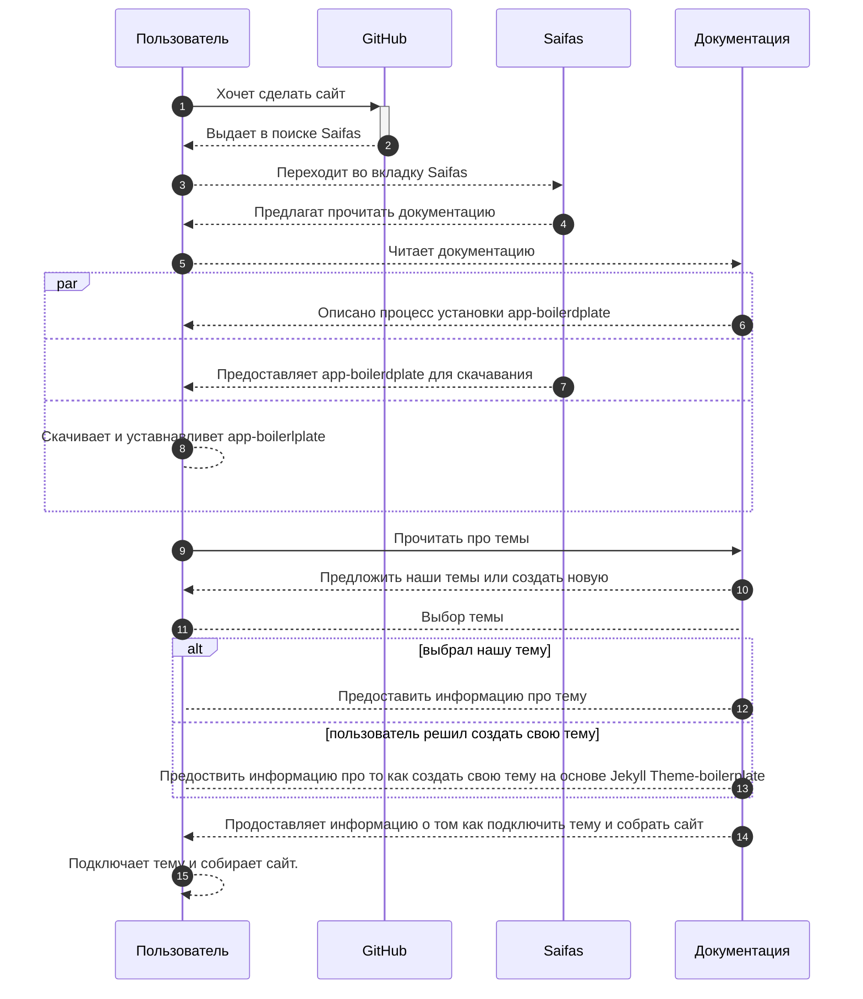

# Class Diagram

```mermaid
sequenceDiagram
autonumber
Пользователь ->>+GitHub: Хочет сделать сайт
GitHub -->>-Пользователь : Выдает в поиске Saifas
Пользователь -->> Saifas : Переходит во вкладку  Saifas
Saifas -->> Пользователь : Предлагат прочитать документацию
Пользователь -->> Документация : Читает документацию
par 
Документация -->> Пользователь : Описано процесс установки app-boilerdplate
and 
Saifas -->> Пользователь : Предоставляет app-boilerdplate   для скачавания
and 
Пользователь --> Пользователь : Скачивает и уставнавливет app-boilerlplate
end
Пользователь ->> Документация : Прочитать про темы
Документация -->> Пользователь : Предложить наши темы или создать новую
Пользователь --> Документация : Выбор темы
alt выбрал нашу тему
Документация --> Пользователь : Предоставить информацию про тему
else пользователь решил создать свою тему
Документация --> Пользователь : Предоствить информацию про то как создать свою тему на основе Jekyll Theme-boilerplate
end
Документация -->> Пользователь : Продоставляет информацию о том как подключить тему и собрать сайт
Пользователь -->> Пользователь : Подключает тему и собирает сайт.

 


```
